# Lock Crackers - Password Guessing Game


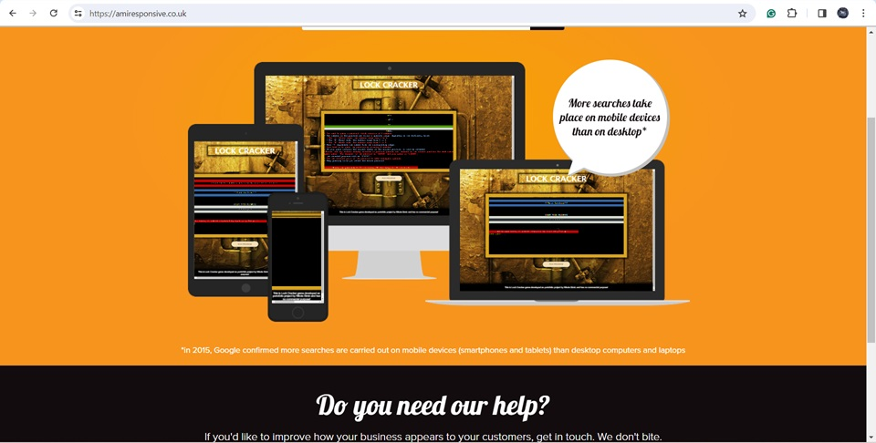


## Table of Contents

1. [Overview](#overview)
2. [Game Flow](#game-flow)
3. [Features](#features)
4. [Future Features](#future-features)
5. [Technologies](#technologies)
6. [Goals](#goals)
7. [Users](#users)
8. [How to Play](#how-to-play)
9. [Instructions](#instructions)
   - [Dependencies](#dependencies)
   - [Installation](#installation)
   - [Running the Game](#running-the-game)
   - [Example Output](#example-output)
10. [Credits](#credits)

## Overview

Lock Crackers is an engaging and entertaining password guessing game designed to test your skills in cracking passwords. It provides an exciting challenge where players attempt to guess a password composed of six numbers within a specific range. With multiple difficulty levels and an intuitive interface, Lock Crackers offers an enjoyable gaming experience for users of all ages.


## Game Flow
   **Logic behind the game:**
   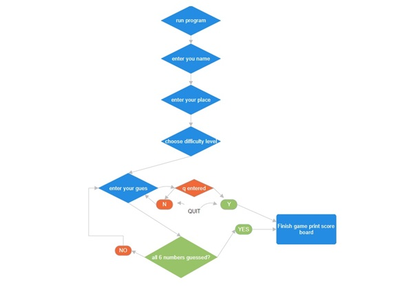

1. **Welcome Message and Player Information:**
   - The game starts with a welcome message and prompting the player to enter their name and location.

    

   - Before proceeding with the game, certain validations are applied to ensure the correctness of user input. Only letters and spaces are accepted. Any input containing other characters will be rejected, prompting the user to provide valid input.

    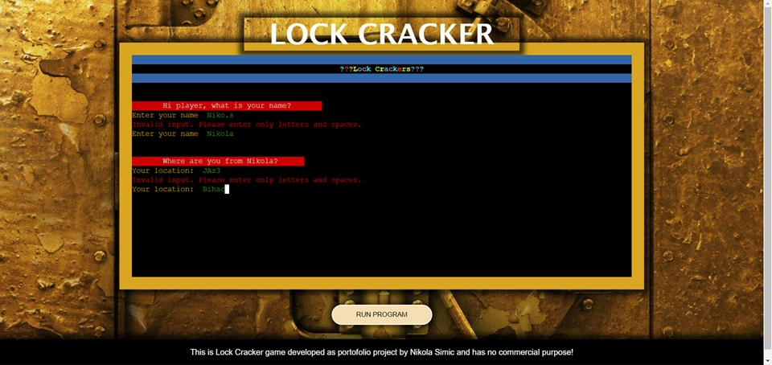

   - The player is greeted with a colorful display of their name and their location.

    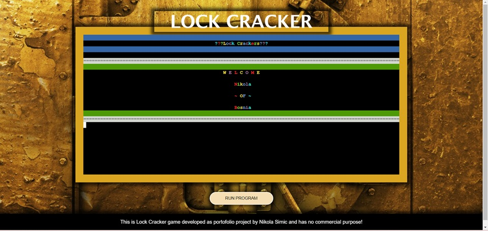
  

2. **Game Rules:**
   - The game rules are displayed, explaining how to play the game and the objective of cracking the password.
   - Rules are displayed with alternating colors for better visibility.

    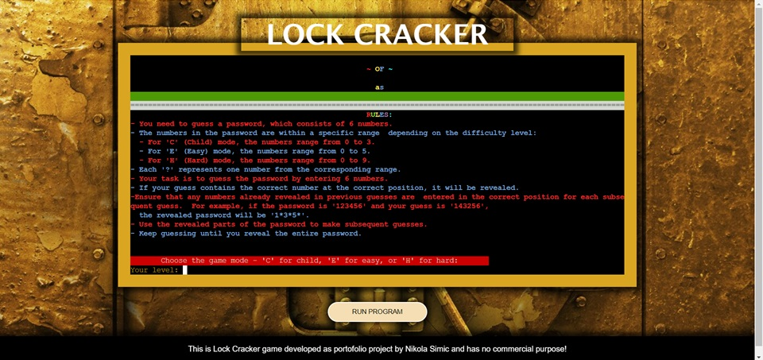

3. **Choose Difficulty Level:**
   - The player is prompted to choose a difficulty level: 'C' for Child mode (0-3), 'E' for Easy mode (0-5), or 'H' for Hard mode (0-9).

4. **Game Initialization:**
   - A random password is generated based on the chosen difficulty level.
   - The password is hidden, and the player needs to guess it.

    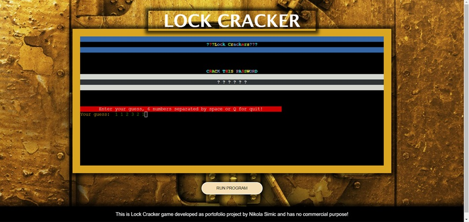

5. **Main Game Loop:**
   - During the main game loop, several steps occur:
     - The player is prompted to enter their guess for the password.
     - The guess is validated, ensuring it contains only letters and spaces, and feedback is provided if the input is invalid.
     - If the player wants to quit, they can enter 'q'.
     - The player's guess is compared to the hidden password, and feedback is provided based on correctness.
     - The game continues until the player either cracks the password or decides to quit.


- Hidden Password - Password Validation
The welcome message displayed when the game starts, ensuring the player's name input is valid.
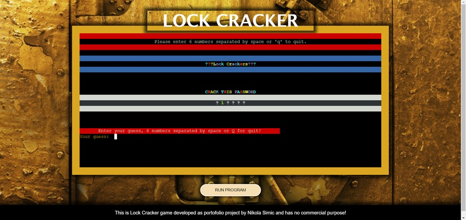


- Input Password Validation Message
A validation message displayed when the player's guess contains invalid characters or format.
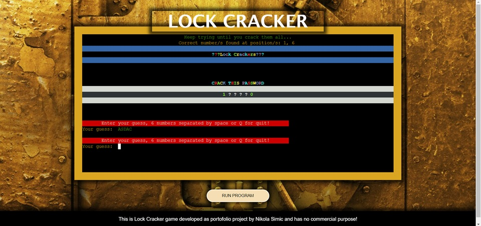


- Correct Position Validation Message
This message indicates that some numbers guessed in previous attempts are correct but not placed in the correct position in the current guess.
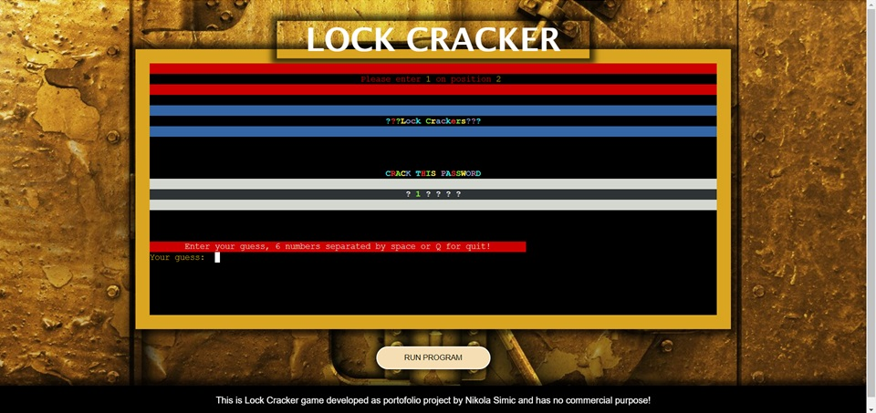


- Quit Input Message
Prompt asking the player if they want to quit the game.
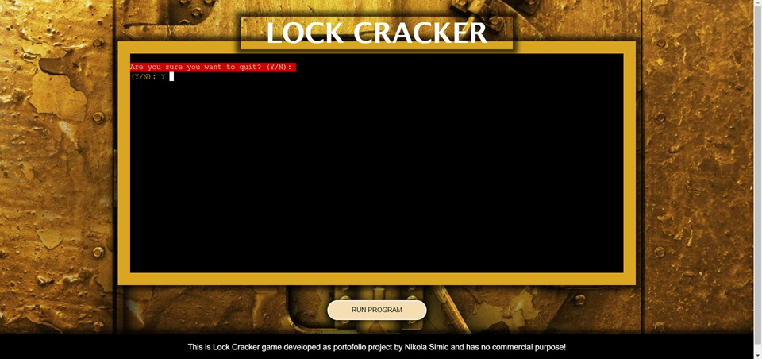


6. **Game Outcome:**
   - The game outcome is presented in vibrant colors to enhance visual pleasure.
   - If the player successfully cracks the password, they win the game.
   - If the player decides to quit, the game ends with the option to view the password and the elapsed time.
   - Player information and game outcome are saved to a Google Sheets leaderboard.
   - The leaderboard is displayed, showing the top 10 players sorted by the best time.
   - It includes the player's name, position, difficulty level status, and time.

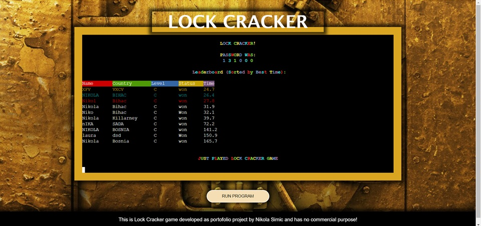


## Features

- Three difficulty levels: Child (C), Easy (E), and Hard (H).
- Interactive gameplay with real-time feedback on password guesses.
- Google Sheets integration for leaderboard tracking.
- Cross-platform compatibility, playable on Windows, macOS, and Linux.
- ASCII art display for a visually appealing experience.
- Background image for a visually appealing experience.
- Welcome message for an engaging start.
- Greetings displayed after entering player information.
- Colorful interface for an immersive experience.
- Footer with information about the author.

## Future Features

- **User Profiles**: Allow users to create profiles to track their game statistics and progress.
- **Multiplayer Mode**: Introduce a multiplayer mode where users can compete against each other.
- **Custom Passwords**: Enable users to create custom passwords for added challenge and personalization.
- **Enhanced Graphics**: Implement improved graphics and animations to enhance the overall gaming experience.
- **Achievements and Rewards**: Introduce achievements and rewards to incentivize gameplay and engagement.
- **Scores by Difficulty Range**: View scores sorted by difficulty level to see how players performed in each mode.


## Technologies

Lock Crackers is built using the following technologies:

- **Python**: Programming language used for game logic and implementation.
- **gspread**: Python library for interacting with Google Sheets.
- **oauth2client**: Python library for OAuth 2.0 authentication.
- **ASCII Art**: ASCII art used to enhance the visual presentation of the game.
- **Windows Paint**: Used for creating graphics and images for the project.
- **Git**: Version control system used for tracking changes in the project codebase.
- **Heroku**: Cloud platform used for deploying and hosting the Lock Crackers application.
- **Visual Studio Code**: Integrated development environment (IDE) used for code editing and project management.


## Goals

Our primary goals for Lock Crackers are:

1. **User Engagement**: Provide an engaging and enjoyable gaming experience for users of all skill levels.
2. **Accessibility**: Ensure that the game is accessible and playable across different devices and platforms.
3. **Community Building**: Foster a community of players by encouraging interaction, competition, and collaboration.
4. **Continuous Improvement**: Regularly update and enhance the game with new features and improvements based on user feedback.

## Users

Lock Crackers is suitable for:

- Casual Gamers: Individuals looking for a fun and challenging game to pass the time.
- Puzzle Enthusiasts: Players who enjoy solving puzzles and cracking codes.
- Educators: Teachers and educators who want to use gamification as a learning tool for students.
- Python Enthusiasts: Developers interested in exploring Python programming through game development.

## How to Play

1. **Objective**: Guess the password correctly within the specified number range.
2. **Game Modes**:
   - **Child (C)**: Numbers range from 0 to 3.
   - **Easy (E)**: Numbers range from 0 to 5.
   - **Hard (H)**: Numbers range from 0 to 9.
3. **Rules**:
   - Guess a password of 6 numbers.
   - Correct numbers at the correct positions will be revealed.
   - Use revealed parts of the password for subsequent guesses.
   - Keep guessing until you reveal the entire password.

## Instructions

### Dependencies

Ensure you have Python installed on your system.

### Installation

1. Clone the Repository:

   ```bash
   git clone https://github.com/nlekkerman/lock_crackers.git


### Deployment

#### GitHub:
1. **Template Usage:** Started the project by navigating to the CI template and clicking on 'Use this template'. Provided the name Lock Crackers for the this/new repository.
2. **Development Environment:** After creating the repository, proceed to Visual Studio where the entire project development takes place.

#### Version Control:

During the development process, I primarily utilized version control commands within Visual Studio Code. However, users can also use the terminal to execute these commands.

- **Git Commands:**
   - `git add .`: Add new, deleted, and modified files to the Git staging area.
   - `git add <file>`: Add a specified file to the Git staging area.
   - `git reset`: Unstage all files (remove from Git staging area).
   - `git reset -- <file>`: Unstage a specified file.
   - `git commit -m "commit message"`: Commit changes to the local repository with a descriptive message.
   - `git push`: Push all committed changes to the GitHub repository.
   - `git pull`: Pull changes from the remote branch and integrate them with the current local branch.
   - `git status`: Display the state of the working directory and the staging area.
   - `git branch`: Display all branches in the repository.
   - `git checkout -b <branch>`: Create a new branch.
   - `git checkout <branch>`: Switch to the specified branch.
   - `git log`: Display commits.
   - `git revert <first 6 digits of the commit ref>`: Undo changes by creating a new commit to cancel changes to the state of the specified commit.


#### Heroku:
- **Hosting Platform:** Heroku was utilized to host the Lock Crackers app. Heroku provides a container-based cloud platform for building, deploying, and managing applications.
- **Deployment Steps:**
   1. Fork or clone this repository.
   2. Log into your account on Heroku.
   3. Create a new Heroku app.
   4. Navigate to the Settings tab.
   5. Set up environmental variables in the config vars section (e.g., CREDS for Google service account credentials and PORT set to 8000).
   6. Set the buildpacks to Python and NodeJS, in that order.
   7. Configure GitHub integration and choose the main branch in the Deploy tab.
   8. Click Deploy branch to initiate the deployment process.


## Credits


#### Code

- **This README.md file was created with the assistance of the template provided by;**
 - [oks-erm](https://github.com/oks-erm).

- **To OpenAI for speeding up the creation of this Application.**
 - Reduces development time and speeds up the creation of this application by minimizing time spent on research and typing tasks.

 - For providing assistance and support


#### Special Thanks

We would like to express our gratitude to the following individuals and resources for their support:

- **Mr. Brian O'Hare**: Mentor
- **OpenAI**: For providing assistance and support


