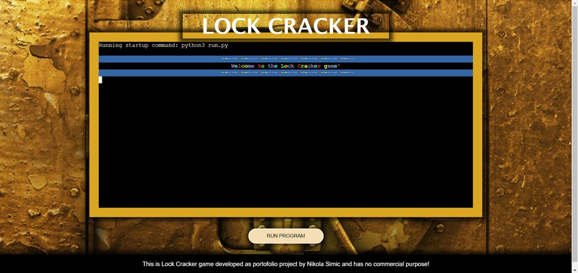

# Lock Crackers - Password Guessing Game

## Table of Contents

1. [Overview](#overview)
2. [Features](#features)
3. [Technologies](#technologies)
4. [Future Features](#future-features)
5. [Goals](#goals)
6. [Users](#users)
7. [How to Play](#how-to-play)
8. [Instructions](#instructions)
   - [Dependencies](#dependencies)
   - [Installation](#installation)
   - [Running the Game](#running-the-game)
   - [Example Output](#example-output)
9. [Credits](#credits)

## Overview

Lock Crackers is an engaging and entertaining password guessing game designed to test your skills in cracking passwords. It provides an exciting challenge where players attempt to guess a password composed of six numbers within a specific range. With multiple difficulty levels and an intuitive interface, Lock Crackers offers an enjoyable gaming experience for users of all ages.

## Game Flow

1. **Welcome Message and Player Information:**
   - The game starts with a welcome message prompting the player to enter their name and location.
   - The player is greeted with a colorful display of their name and location.
   

2. **Game Rules:**
   - The game rules are displayed, explaining how to play the game and the objective of cracking the password.
   - Rules are displayed with alternating colors for better visibility.

3. **Choose Difficulty Level:**
   - The player is prompted to choose a difficulty level: 'C' for Child mode (0-3), 'E' for Easy mode (0-5), or 'H' for Hard mode (0-9).

4. **Game Initialization:**
   - A random password is generated based on the chosen difficulty level.
   - The password is hidden, and the player needs to guess it.

5. **Main Game Loop:**
   - The player is prompted to enter their guess for the password.
   - The guess is validated, and feedback is provided if the input is invalid.
   - If the player wants to quit, they can enter 'q'.
   - The player's guess is compared to the hidden password, and feedback is provided based on correctness.
   - The game continues until the player either cracks the password or decides to quit.

6. **Game Outcome:**
   - If the player successfully cracks the password, they win the game.
   - If the player decides to quit, the game ends with the option to view the password and the elapsed time.
   - Player information and game outcome are saved to a Google Sheets leaderboard.
   - The leaderboard is displayed, showing the top 10 players sorted by the best time.

7. **Conclusion:**
   - The player is informed that they have completed the Lock Cracker game.
   - The game can be played again by running the main function.

## Features

- Three difficulty levels: Child (C), Easy (E), and Hard (H).
- Interactive gameplay with real-time feedback on password guesses.
- Google Sheets integration for leaderboard tracking.
- Cross-platform compatibility, playable on Windows, macOS, and Linux.
- ASCII art display for a visually appealing experience.
- Background image for a visually appealing experience.
- Welcome message for an engaging start.
- Greetings displayed after entering player information.
- Colorful interface for an immersive experience.
- Footer with information about the author.

## Future Features

- **User Profiles**: Allow users to create profiles to track their game statistics and progress.
- **Multiplayer Mode**: Introduce a multiplayer mode where users can compete against each other.
- **Custom Passwords**: Enable users to create custom passwords for added challenge and personalization.
- **Enhanced Graphics**: Implement improved graphics and animations to enhance the overall gaming experience.
- **Achievements and Rewards**: Introduce achievements and rewards to incentivize gameplay and engagement.
- **Scores by Difficulty Range**: View scores sorted by difficulty level to see how players performed in each mode.


## Technologies

Lock Crackers is built using the following technologies:

- **Python**: Programming language used for game logic and implementation.
- **gspread**: Python library for interacting with Google Sheets.
- **oauth2client**: Python library for OAuth 2.0 authentication.
- **ASCII Art**: ASCII art used to enhance the visual presentation of the game.

## Goals

Our primary goals for Lock Crackers are:

1. **User Engagement**: Provide an engaging and enjoyable gaming experience for users of all skill levels.
2. **Accessibility**: Ensure that the game is accessible and playable across different devices and platforms.
3. **Community Building**: Foster a community of players by encouraging interaction, competition, and collaboration.
4. **Continuous Improvement**: Regularly update and enhance the game with new features and improvements based on user feedback.

## Users

Lock Crackers is suitable for:

- Casual Gamers: Individuals looking for a fun and challenging game to pass the time.
- Puzzle Enthusiasts: Players who enjoy solving puzzles and cracking codes.
- Educators: Teachers and educators who want to use gamification as a learning tool for students.
- Python Enthusiasts: Developers interested in exploring Python programming through game development.

## How to Play

1. **Objective**: Guess the password correctly within the specified number range.
2. **Game Modes**:
   - **Child (C)**: Numbers range from 0 to 3.
   - **Easy (E)**: Numbers range from 0 to 5.
   - **Hard (H)**: Numbers range from 0 to 9.
3. **Rules**:
   - Guess a password of 6 numbers.
   - Correct numbers at the correct positions will be revealed.
   - Use revealed parts of the password for subsequent guesses.
   - Keep guessing until you reveal the entire password.

## Instructions

### Dependencies

Ensure you have Python installed on your system.

### Installation

1. Clone the Repository:

   ```bash
   git clone https://github.com/nlekkerman/lock_crackers.git
